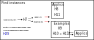
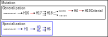
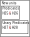
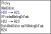
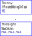

Any descriptions of functionality are based on the functionality of Eurisclo (branch zombies, commit 19ad7898554bd0c82d) with no modification. "In Eurisclo" indicates that behavior occurs within Eurisclo, but not *exclusively* within Eurisclo.

"Subsumed" within this context means that the cases in which a heuristic triggers are a subset of that of another heuristic. If H5Criterial subsumes H5, then there are no cases where H5 will trigger without H5Criterial also triggering. (These are hard-coded as Subsumes/SubsumedBy statements in the codebase.)
## Key to diagrams
- An underline indicates that a heuristic has a 100% success rate when it triggers.
- An arrow indicates that the execution of the left in some way triggers the right heuristic (e.g. by creating a task or unit). A red arrow indicates that the left will always trigger the right.
- Blue indicates that a heuristic never triggers in Eurisclo.
- An ampersand (&) indicates that two heuristics always trigger together.
- An equals (=) indicates that two heuristics are functionally equivalent.

# Instance generation

In Eurisclo, this is the most active and productive set of heuristics.
### H7
Add tasks to find instances (either examples or application instances) for a unit **u** that currently has none.
## Applics
Either one or both H8 and H11 may run if the task is to find application instances.
### H8
If generalizations of **u** exist, check if any of the application instances of these generalizations are also application instances of **u**.
### H11
If **u** has an algorithm, use it to compute application instances.
## Examples
### H9
If generalizations of **u** exist, check if any of the examples of these generalizations are also examples of **u**. (Like H8 for examples)
### H10/H15
If **u** is the range of some operator **f**, check the application instances of **f** for examples of **u**. This may require looking for application instances of **f** if it currently has none, in which case H10/H15 both create a task to find application instances of **f** (Task A) and a task to try again at finding examples for **u** (Task B). In Eurisclo, since H10/H15 are reinvoked in Task B, if Task A times out and fails, it results in a loop. In this case the loop repeats, downgrading the next iteration of Task B in worth each time Task A is forced to suspend, until another task/unit takes priority.

H10 and H15 seem identical, and their redundancy has the result of boosting the worth of any task they want to create (since tasks can't be duplicated on the agenda).

## Other
### H29
If **u** is a multi-element structure, the current task is to find examples, and some examples exist, then create new examples by permuting the multiplicities of existing examples. In Eurisclo this set of conditions is apparently never met.

# Mutation

## Generalization
### H16
Add a task to generalize a unit that has useful applics. In Eurisclo, H16 only ever selects units that are heuristics (only heuristics have the "applics" field).
### H17
Choose slots to generalize and create a task for each one (hence the multi-arrow to H18).
### H18
Attempt to generalize the given slot of the given unit. In Eurisclo, it usually fails since it can't figure out how to generalize most of the heuristic slots, and only ends up generalizing non-criterial slots (like "english").
### H4
Add tasks to gather instances of new units.
### H19Criterial
Delete any new units that are have identical criterial slots to an existing unit. In Eurisclo, H19Criterial deletes every heuristic produced by generalization. There is also a normal H19 which deletes any new units that have all identical slots (both criterial and non-criterial) to an existing unit, but in Eurisclo I have not seen this unit activate. (H19Criterial subsumes H19.)
## Specialization
In Eurisclo, none of these trigger. However, in the code, H1, H5, and H6 are credited with producing H5Criterial, H5Good, and H19Criterial.
### H1
Add a task to specialize a unit that has limited useful applics. Seems to correspond to H16. In Eurisclo, the IfPotentiallyRelevant of H1 triggers on heuristics, but IfTrulyRelevant never triggers.
### H3
Choose slots to specialize and create a task for each one. Seems to correspond to H17.
### H5 
Appears to be functionally equivalent to H3, but subsumes H3. H5 also has variants H5Good and H5Criterial which never activate in Eurisclo. (These variants subsume both H3 and H5.)
### H6
Attempt to specialize the given slot of the given unit. Seems to correspond to H18.

# New units

All of these are work-on-unit tasks and produce a steady flow of new units for the instance generation pipeline to process. (New operators are also being produced which feed into these, but not through heuristics. The compose operator is involved heavily in this.)

## Predicates
### H25
If **f** is a high worth or interesting predicate, create the unit **satisfying-set-for-f**.
### H26
If **f** is a high worth or interesting predicate, create the unit **failing-set-for-f**.
## Unary predicates
### H27
If **f** is a high worth or interesting *unary* predicate, create the unit **satisfying-set-for-f**. Note that the conditions for H27 are a subset of those for H25 (Pred is a generalization of UnaryPred), and so the unit created by H27 is a duplicate and has a name like **satisfying-set-for-f261** (with some number added to avoid a duplicate name).
### H28
If **f** is a high worth or interesting *unary* predicate, create the unit **failing-set-for-f**. Note that the conditions for H28 are a subset of those for H26 (Pred is a generalization of UnaryPred), and so the unit created by H28 is a duplicate and has a name like **failing-set-for-f261** (with some number added to avoid a duplicate name).
# Picky heuristics

These heuristics evaluate interestingness, make conjectures, and generally compare units and instances.

### H20
If unit **f** is an operation with an algorithm and a specific subset of similar operations exists, apply **f** to the domains of that subset and add a task to look for patterns. (I think the reason this never runs in Eurisclo is because no operation has the required subset of sibling operations.) Also, the comments on this heuristic are the same as the comments on H1 and H16, but its code is different (since this is in EUR, likely a mistake from the original).

### H21
If operator **u** duplicates the applics of related operator **u2**, conjecture that **u** is an extension of **u2**. This task only runs if CurSlot is 'Conjectures, which is only true in the task that H20 creates to look for patterns (in addition to RelatedOperators being unique to that task). So this is one of the heuristics meant to look for patterns after H20.

### H22
If new instances of **u** have been found, and (Interestingness **u**) produces a non-zero result, add a task to check if any new instances are interesting.

### H23
Check for interesting examples. It doesn't seem like there's an equivalent heuristic for application instances. In Eurisclo, H22 never produces any INT-APPLICS tasks, only INT-EXAMPLES tasks.

### H24
If **u** is a category, check if all examples of **u** satisfy any of the rare and high-worth predicates. If this is true for at least one such predicate, then **u** is made interesting. This heuristic usually triggers a few times during a Eurisclo run on units like **Anything** but rarely succeeds. (I've seen it succeed once before during a run but unfortunately didn't save the log.) 

# Destroy, Avoid and Hindsight
 

## Destroy
### H2
If new units were created, and one of the creditors **C** for one of the new units has >= 10 applics, but all the concepts produced in these applics have null applics, then delete **C** and all the concepts it created. **C** also has to be a generated unit, not a handwritten one. In Eurisclo, no new heuristic is produced without being immediately destroyed by H19Criterial, so this heuristic doesn't do anything. In EUR (and consequently Eurisclo) this is the only part of the program that modifies the variable DeletedUnits.
## Hindsight
The role of hindsight heuristics is to prevent concepts that H2 destroyed (specifically the main one, not its created concepts?) from being created again by creating specifications of HAvoid.
### H12
If concept **C** is marked for destruction by H2, and **C** was created by varying slot **c** of a unit in order to find slot **g** of that unit, create a specialization of HAvoid to prevent slot **c** or any of its siblings from being varied when trying to find slot **g** of a unit in the future. (For a more concrete example see HAvoidIfWorking). In EUR, H12 is credited with creating HAvoidIfWorking.
### H13
Let concept **C** be marked for destruction by H2, and **C** was created by changing value **a** to value **b** within slot **c** of a unit, and furthermore this was all in order to find slot **g** of that unit. Then, create a specialization of HAvoid2. When a task tries to find slot **g** of a unit in the future, prevent any instance of the value **a** within **c** or any of its siblings from being changed. (For a more concrete example see HAvoid2AND). In EUR, H13 is credited with creating HAvoid2AND.
### H13
Let concept **C** be marked for destruction by H2, and **C** was created by changing value **a** to value **b** within slot **c** of a unit, and furthermore this was all in order to find slot **g** of that unit. Then, create a specialization of HAvoid3. When a task tries to find slot **g** of a unit in the future, prevent any value within **c** or any of its siblings from being changed into **b**.  (For a more concrete example see HAvoid3First). In EUR, H14 is credited with creating HAvoid3First.
## Avoid
The HAvoid heuristics provide templates for the hindsight heuristics to specialize. According to the EUR code, HAvoidIfWorking, HAvoid2AND, and HAvoid3First all seem to have originated from one failed mutation of H1 called H1-11, in which part of IfWorkingOnTask's code was changed from AND to TheFirstOf. It appears that H2 destroyed this heuristic and H12, H13, and H14 all produced heuristics to avoid anything similar being created.

### HAvoid
If the current task is to find slot **g** of a unit by varying slot **c** or its siblings, cancel the task.

### HAvoidIfWorking
If the current task is to find generalizations (i.e. the slot **Generalizations**) of a unit by varying slot **IfWorkingOnTask** or its siblings (any of the if-parts), cancel the task. *However*, HAvoidIfWorking includes a a one in ten chance to not cancel the new heuristic, which appears to have been added in manually.

### HAvoid2
If the current task attempted to find slot **g** of a unit by varying slot **c** or its siblings, and in the process changed a value **a** within that slot or its siblings, kill the new mutated unit.

### HAvoid2AND
If the current task attempted to find generalizations (i.e. the slot **Generalizations**) of a unit by varying slot **IfWorkingOnTask** or its siblings (any of the if-parts), and in the process changed a value **AND** within that slot (i.e. changed an instance of AND within the code of IfWorkingOnTask to something else), kill the new mutated unit.

### HAvoid3
If the current task attempted to find slot **g** of a unit by varying slot **c** or its siblings, and in the process changed a value within that slot or its siblings to value **b**, kill the new mutated unit.

### HAvoid3First
If the current task attempted to find generalizations (i.e. the slot **Generalizations**) of a unit by varying slot **IfWorkingOnTask** or its siblings (any of the if-parts), changed a value within that slot or its siblings to value **TheFirstOf** (i.e. changed a piece of code to TheFirstOf), kill the new mutated unit.
